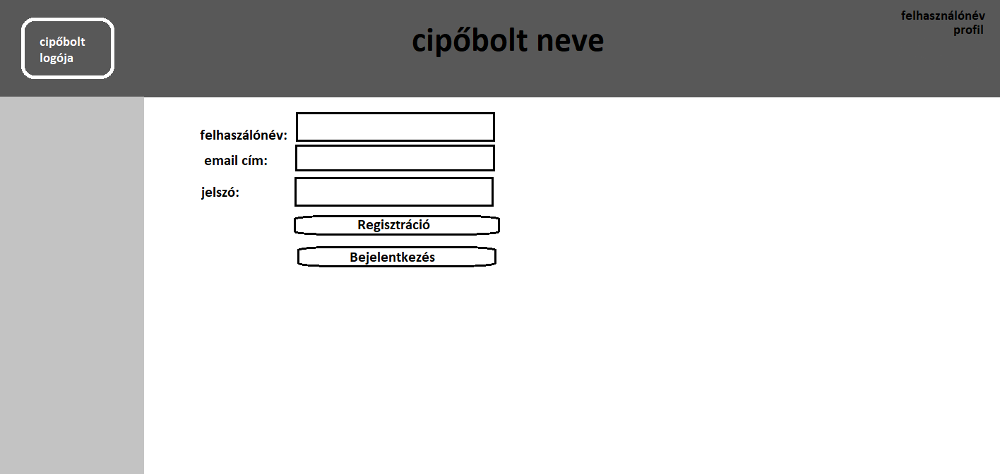

# Funkcionális specifikáció
## 1. Jelenlegi helyzet leírása

Manapság már elképzelhetetlen egy új termék nagyobb tömegekhez való eljuttatása online felület nélkül. Sokan már szinte minden terméket webshopokból szereznek be. Weboldalunk is ezt a célt szolgálja, egy cipőmárka saját termékeit lehet a webshopban megvásárolni. Az oldalon bejelentkezést követően lehet rendelni a termékek közül, a felhasználók korábbi vásárlásaikat is meg tudják tekinteni.

## 2. Vágyálomrendszer leírása

A megrendelő olyan felületet szeretne, amivel könnyedén, otthonról is megvásárolhatja bárki a neki tetsző cipőt, anélkül, hogy ehhez személyesen meg kelljen jelenni a boltban. Implentálni kell egy belépőrendszert, ehhez tartozni fog egy jogusultáság rendszer is. A be nem lépett felhasználók csak megtekinteni tudják a lábbeliket. A belépett, felhasználói profillal rendelkező felhasználók pedig vásárolni is tudnak az oldalról. A megrendelő szeretne egy funkciót, amit csak ő, illetve a bolt dolgozói érnek el. Ezzel a funkcióval tudják az új termékeket a weboldalon megjeleníteni. Amennyiben pedig egy termék elfogyott a raktárból, a felhasználók nem rendelhetnek belőle. A felhasználói profilban meg kell jeleníteni a korábban vásárolt termékeket, illetve a szállítás alatt lévő cipőket is. A megrendelő továbbá azt szeretné, hogy az alkalmazás alkalmazkodjon az adott eszközön lévő kijelző méretéhez, vagyis reszponzív legyen a felület!

## 3. Jelenlegi üzleti folyamatok modellje

Jelenleg a megrendelőnek csak rendes (fizikai) boltja van, így sokkal kevésbé hatékonyan jut el a termék új vevőkhöz. Internetes hirdetés nélkül manapság nagyon nehéz fennmaradni a piacon. Illetve nagyobb cipőboltok webshopjaiban (Deichmann, CCC, stb...) találhatók meg a termékei, ami miatt pedig bevételtől esik el. A nagyobb cipőboltok is szeretnének profitálni természetesen, ami miatt akár 10-15% bevételtől is eleshet a megrendelő eladott termékenként. 

## 4. Igényelt üzleti folyamatok modellje

A vevők akár otthonról is kényelmesen tudnak válogatni a cipők között. Ezen felül nyomonkövethetik folyamatban lévő, vagy teljesült rendeléseiket is. A megrendelő pedig könnyebben tudja hirdetni termékeit, ráadásul a termékek nyilvántartása is egyszerűbbé válik. Emellett a saját webshopban eladott termékek teljes profitja a megrendelőhöz kerül, nem vonnak le belőle a viszonteladó cégek.

## 5. Követelménylista

| Id | Modul | Név | Leírás |
| :---: | --- | --- | --- |
| K1 | Felület | Remember me | Tick-box a belépési adatok tárolásának eldöntésére |
| K2 | Felület | Login | A megadott felhasználónév és jelszó kombináció beléptetése a felületre |
| K3 | Felület | Register | Új felhasználó hozzáadása a felület adatbázisához |
| K4 | Felület | Products | A termékeket megjeleníti, belépett felhasználóknak vásárlási lehetőség |
| K5 | Felület | Purchase | Bejelentkezett felhasználók rendelhetnek terméket |
| K6 | Felület | Service | A megfelelő jogosultsággal rendelkező felhasználók új terméket vihetnek fel az adatbázisba |
| K7 | Felület | Profile | A felhasználó megtekintheti a saját fiókjával kapcsolatos adatokat, korábbi rendelésket |

## 6. Használati esetek

Az oldalra látogatva automatikusan megjelennek a webshopból rendelhető termékek. Menüből elérhető a bejelentkezés, illetve egy regisztrációs felület.
Regisztrált felhasználóknak lehetősége van rendelni az oldalról, illetve a profiljukat, rendeléseiket megtekinteni.
Megfelelő jogosultsággal új termékeket is lehet felvinni az oldalra.

## 7. Megfeleltetés, hogyan fedik le a használati eseteket a követelményeket

K1, K2, K3: Belépőrendszer kezelése, felhasználó megjegyzése, regisztrálás, belépés
K4, K5 K6- Ezen a felületen jelennek meg a megvásárolható termékek, illetve bejelentkezve itt lehet vásárolni. A bolt dolgozói ezen keresztül kezelik a termékeket.
K7 - Saját adatok megjelenítése itt történik.

## 8. Képernyőtervek

## 9. Forgatókönyvek

Az oldalhoz nincs szükség különösebb telepítési és használati útmutatóra. Elég, ha egy grafikus felülettel rendelkező webböngésző fel van telepítve ( alapértelmezett: windows - internet explorer / edge, linux: mozilla, mac - safari ). A felhasználó beüti az oldal címét: xyz.com a böngésző címsorába és rögtön át lesz irányítva az oldalra. Az oldal tartalmát a webszerver szolgáltatja a mögötte lévő adatbázis segítségével. Az oldalra átírányítva a felhasználó megkezdheti a használatát. Ha a felhasználónak bármi nemű problémája akad az oldal működésével kapcsolatban, akkor a megadott elérhetőségek alapján tudja ezt jelezni az oldal karbantartói felé. Az oldal adminisztrátorai moderálják az oldalt a megfelelő eszközök segítségével. Az oldal karbantartásáért felelős csapat pedig az oldal rendeltetésének megfelelő működését ellenőrzi és javítja a felmerülő problémákat.

## 10. Funkció - követelmény megfeleltetése

 * K1 - Remember me - Tick-box a belépési adatok tárolásának eldöntésére.
 * K2 - Login - A megadott felhasználónév és jelszó kombináció beléptetése a felületre.
 * K3 - Register - Új felhasználó hozzáadása a felület adatbázisához.
 * K4 - Products - A termékeket megjeleníti, belépett felhasználóknak vásárlási lehetőség.
 * K5 - Purchase - Bejelentkezett felhasználók rendelhetnek terméket.
 * K6 - Service - A megfelelő jogosultsággal rendelkező felhasználók új terméket vihetnek fel az adatbázisba.
 * K7 - Profile - A felhasználó megtekintheti a saját fiókjával kapcsolatos adatokat, korábbi rendelésket.

## 11 Fogalomszótár

| Fogalom | Leírás |
| :---: | --- |
| Reszponzív felület | Az alkalmazás kompatibilis más elektronikus eszközökön is, így lehet használni számítógépről, tabletről, laptopról és telefonról is, mert alkalmazkodik az eszköz kijelzőjéhez! |
| UML | Unified Modeling Language |
